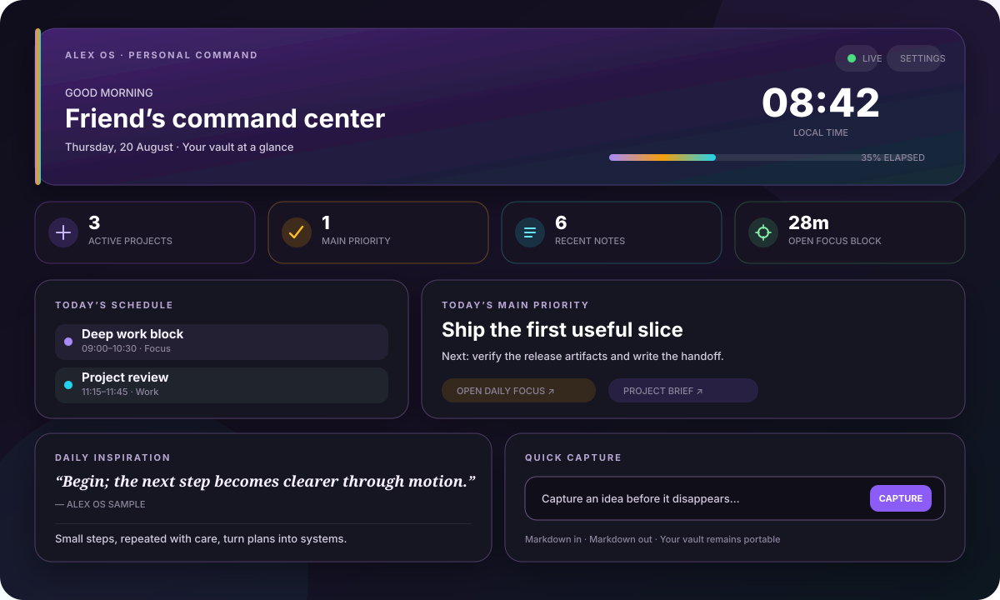

<div align="center">

# Alex OS

### Turn Home.md into your personal command center.

A colorful, local-first dashboard for focus, projects, journaling, quick capture, inspiration, and an optional read-only Google Calendar view.

[](https://github.com/alex-slovakia/alex-os/releases)
[](https://github.com/alex-slovakia/alex-os/actions/workflows/ci.yml)
[](LICENSE)
[](https://obsidian.md)



</div>

> The vault stays the brain. Alex OS is the cockpit.

## What it does

| Module | Source of truth |
| --- | --- |
| Daily focus | A dated Markdown note with simple frontmatter |
| Active projects | Notes marked <code>type: project</code> and <code>status: active</code> |
| Journal | Your configured dated journal folder |
| Quick capture | New Markdown notes in your input folder |
| Inspiration | A quote-pool note plus curated local book-highlight notes |
| Recent activity | Useful recently modified vault notes |
| Calendar | Optional reduced Google Calendar cache |

Alex OS 0.2.1 implements the full local dashboard for Obsidian 1.13.0 or newer on desktop, iPhone, iPad, and Android. It supports light and dark themes, reduced motion, responsive layouts, searchable settings, and useful operation without an online service.

Automated bundle and runtime tests cover mobile loading and Calendar cache behavior. Manual verification on physical iPhone, iPad, and Android devices remains pending in the release checklist.

## Privacy first

- No analytics, advertisements, telemetry, or Alex OS server.
- No live Notion connection.
- Google Calendar is optional and requests only <code>calendar.readonly</code>.
- On desktop, OAuth credentials, refresh tokens, raw Calendar IDs, and sync tokens stay in device-local Obsidian SecretStorage.
- Desktop access tokens stay in memory.
- Mobile never connects to Google or reads Calendar secrets from SecretStorage.
- Only reduced event display data and hashed identifiers enter the optional vault cache.
- The cache can contain user-controlled personal text such as event titles and locations. Treat it as private vault content on every synced device.

Read the complete [privacy model](PRIVACY.md) and [security policy](SECURITY.md).

## 90-second quick start

1. Open **Settings → Community plugins → Browse**.
2. Search for **Alex OS**, install it, and choose **Enable**.
3. Add this block to <code>Home.md</code>:

   ~~~~markdown
   ```alex-os-dashboard
   ```
   ~~~~

4. Open <code>Home.md</code> in Reading view.
5. Open **Settings → Alex OS** and match the folder paths to your vault.

The dashboard gracefully hides modules whose source notes do not exist yet. Copy the starter notes from [examples](examples/) when you want the complete experience.

For BRAT, manual installation details, updating, and troubleshooting, see the [installation tutorial](docs/INSTALLATION.md).

## Markdown contracts

### Daily focus

~~~yaml
---
type: daily-focus
date: YYYY-MM-DD
main_priority: Finish the launch checklist
next_action: Verify the release artifacts
focus_notes:
  - "[[Project brief]]"
---
~~~

### Active project

~~~yaml
---
type: project
status: active
next_action: Ship the first useful slice
---
~~~

### Daily inspiration

~~~yaml
---
type: alex-os-inspiration
quotes:
  - text: Begin; the next step becomes clearer through motion.
    author: Alex OS sample
  - text: Make the useful action easy to repeat.
    author: Alex OS sample
---
~~~

Put migrated or hand-curated highlight notes in the configured book-highlights folder:

~~~yaml
---
type: book-highlights
book_title: The Example Book
author: Example Author
alex_os_highlights:
  - Small steps, repeated with care, turn plans into systems.
  - A second short highlight for tomorrow.
---
~~~

Alex OS deterministically chooses one attributed quote and one library highlight from the local date. Both stay stable during the day and advance after midnight; the normal refresh timer also refreshes local modules. Everything remains ordinary Markdown, so importing from Notion is optional and Alex OS never needs a Notion credential. The earlier single-quote/seven-field format remains a safe fallback.

## Optional Google Calendar

Calendar setup and direct Google synchronization run only in desktop Obsidian. Alex OS uses bring-your-own Google Cloud credentials, a short-lived loopback callback, PKCE, and Obsidian SecretStorage.

On iPhone, iPad, and Android, Alex OS reads the reduced Calendar cache from the vault. Your vault sync provider can carry that private cache from a connected desktop; Alex OS mobile never contacts Google.

Visible calendars are selected on desktop before refresh. Mobile displays only the reduced private data that the desktop writes to the synchronized cache; it cannot change the Calendar selection.

A Google account and permission to create a Google Cloud project are required only for this optional Calendar integration.

Follow the [Google Calendar setup guide](docs/GOOGLE-CALENDAR-SETUP.md). Never paste credentials, authorization codes, or tokens into a note, issue, screenshot, or chat.

## Development

~~~powershell
npm ci
npm run check
~~~

The check runs ESLint, strict TypeScript, a production esbuild bundle, and the full Vitest suite.

Tagged releases are built from source in GitHub Actions. The workflow publishes only <code>main.js</code>, <code>manifest.json</code>, and <code>styles.css</code>, and creates GitHub artifact attestations for the executable and stylesheet.

## Documentation

- [Installation tutorial](docs/INSTALLATION.md)
- [Google Calendar setup](docs/GOOGLE-CALENDAR-SETUP.md)
- [Architecture and security boundaries](docs/ARCHITECTURE.md)
- [Manual release checklist](docs/MANUAL-TEST-CHECKLIST.md)
- [Roadmap](docs/BACKLOG.md)
- [Changelog](CHANGELOG.md)
- [Contributing](CONTRIBUTING.md)

## Community Plugins

Alex OS is listed in the [Obsidian Community Plugins directory](https://community.obsidian.md/plugins/alex-os). GitHub Releases and BRAT remain available for manual or preview installation.

## License

[MIT](LICENSE)
